# E-commerce website With PHP

#### **Sell & BY** is an website where people have the ability to post they **Car** , **Motorcycle** , **Bycicle** , **Scuter** for sale for free.

#### At the moment that someone open the website , he can see all of the shared post.

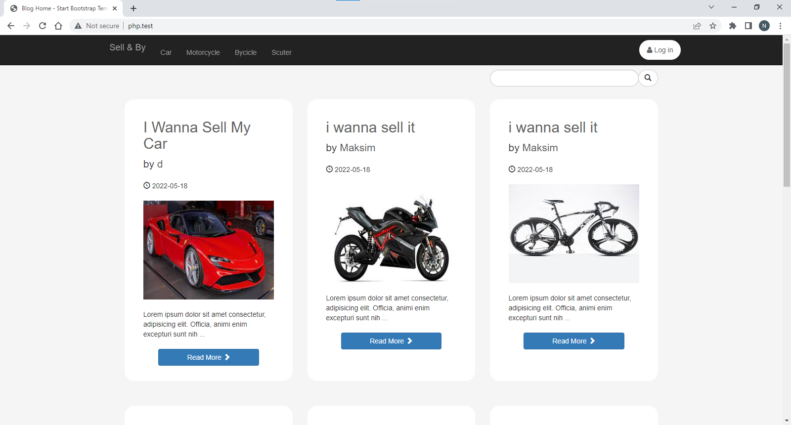

#### By clicking one of the Category on the nav bar **Car** , **Motorcycle** , **Bycicle** , **Scuter** will by listed just the post related with the specify categorry , or in the case that hasn't any posted post related to that category yet will view an Text with meaning **"No Post Sorry"**.

 
 

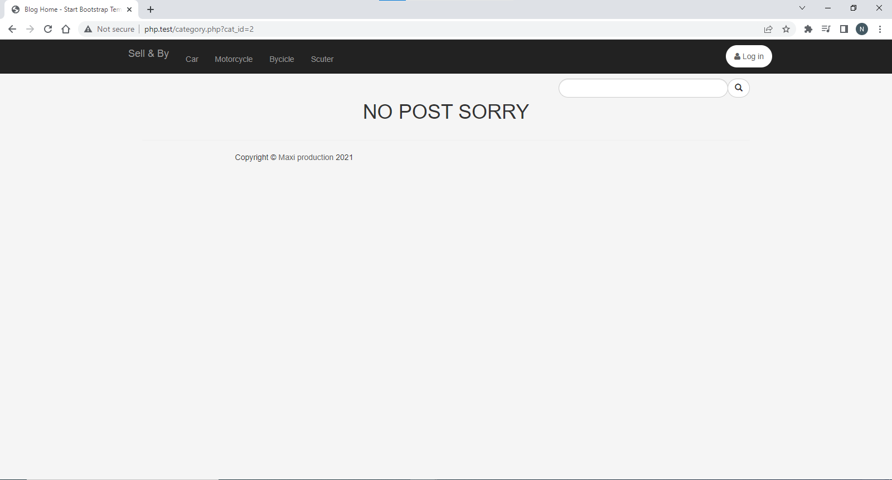

#### Also they have the oppertiunity to search what they are interesting for and again in case that is not possible to find any post related with the search, are gonna get the text **"No Post Sorry"**.

 
 

#### Every post has an title , the date when the have been shared , **Username of "Author"** , the text description and the **Read More Button**. From where you have the oppertiunity to see the full information of the post and view comment on that post just by clicking over the **title** ore the **Read more Button**. Additionally you can comment on it , **If you are logged in.**

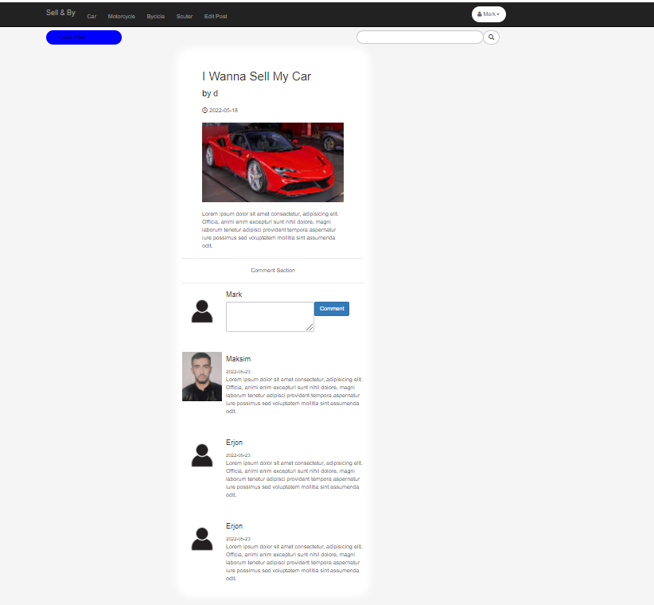\
**If you aren't logged in** you will be asked to log in the web-site.

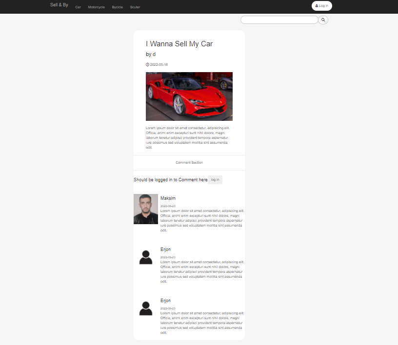

| Username | Password | Role  |
| -------- | -------- | ----- |
| admin    | admin    | admin |
| Marjus   | Marjus   | user  |
| Erjon    | Erjon    | user  |
| Maksim   | Maksim   | user  |
| Mark     | Mark     | user  |

**Her are some registred Account**, through which you can log in.

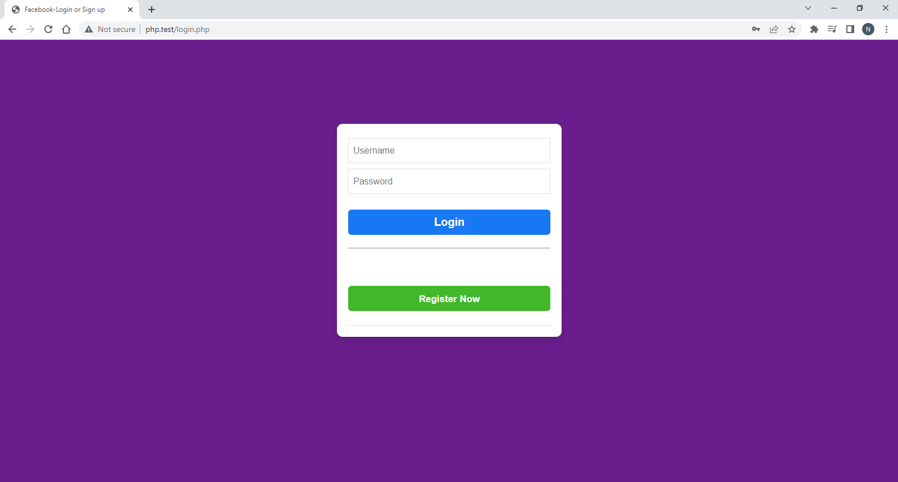

In Case that you try to lgged in with the wrong information , you are gonna get an error messages

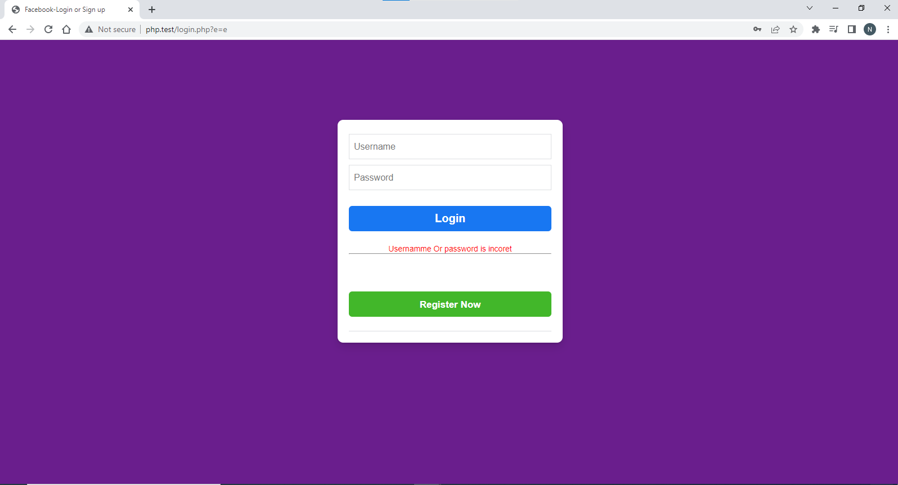

If you are not registered yet, you can click the register button and Fill in the required fields.

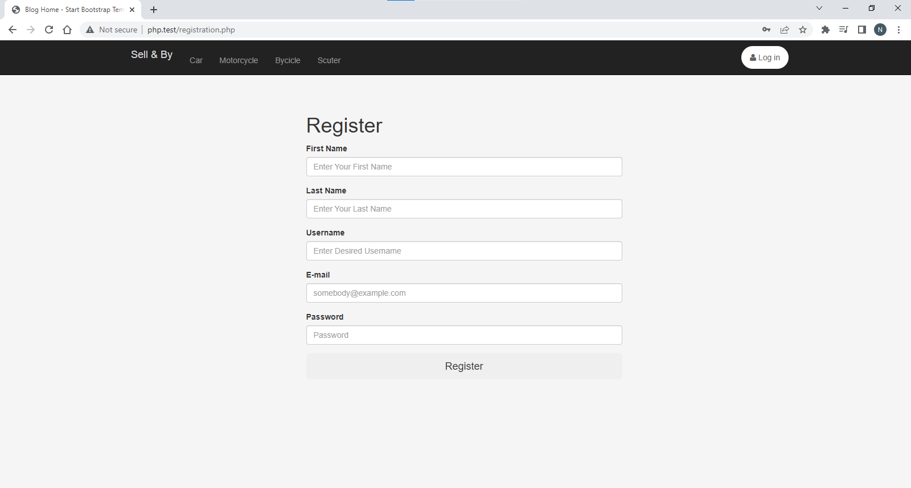

During the registration you should remember your username and your password becouse they are the nesesary information to be logged in. In case that some else is been registred with the same username that you are trying to , you will take an Error Messages with content **Already exist an account with this Username** , which mean that you should try again with an diferent **Username.**

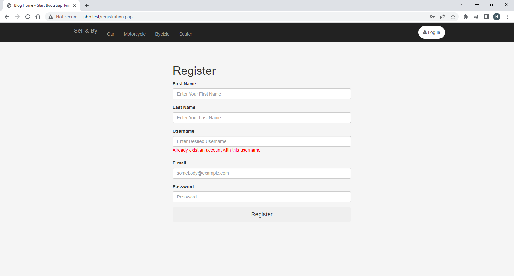

As Well if some one click the username that is shown in which post , you can see the full information of the user LIKE **First Name** **Last Name** his **Email** and all of his shared post.

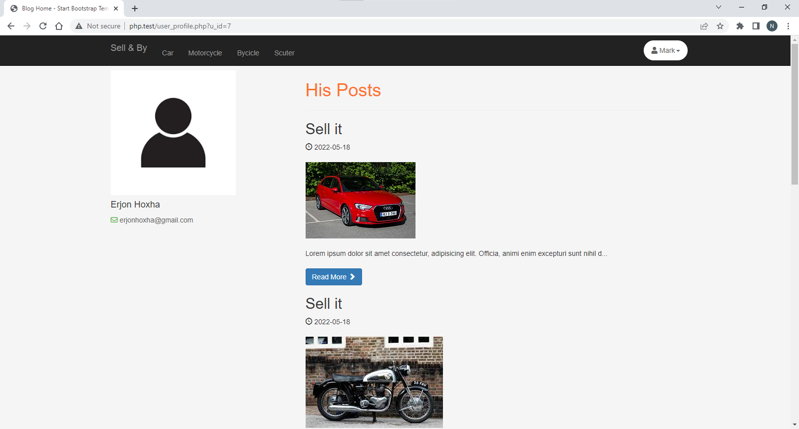

To see that information is not nesesary to logged in....

 
 
 
 

### After user will be logged in , will be redirect to the User panel. **(To the DASHBOARD)**

### Where he can see the number of he's post **How post has share?** , **His Active post** and **Number of the Comments**.

### Which mean:

### **How post has share?** --> The total number of shared post by the logged in user.

### **His Active post** --> The number of Posted that are Aprovide by the administrator to bee shared on the website.

### **Number of the Comments** --> The number of all comments made on the diferent post.

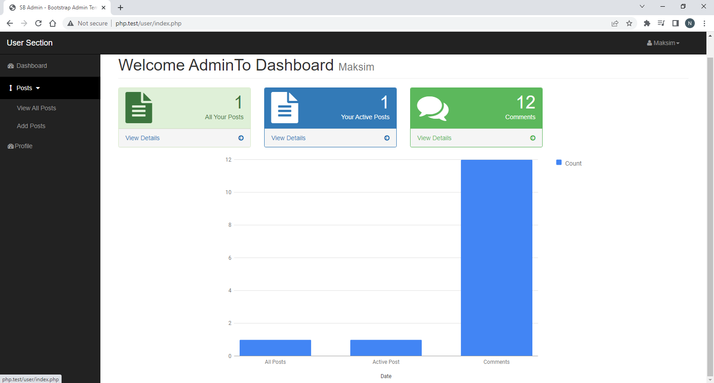

### By clicking the **View All Posts** on the left the user have the oppertiunity to view all of his post in a table.

### For which post he can see they **Title** , **Category** , **Status** , **Photo** , **Tags** , **Comments** , **Date** and in additionl Two Buttons **Edit** and **Delete**.

### The status of the which post can bee **"Published" or "draft"**. Explanation: "Every post at the moment that is posted by the user automaticaly take the **Status = "draft"** , and in a second moment , When the administration of the website commfirm the post. Then the post will has the **Status = "Published"** and can bee viewd by others."

 

### The **Tags** is related with the **search** Opption on the page. Which means that: "At the moment that some wanna search for content **"Car"** all what is gonna happend is that the app will search on the **tags** of the **Published post** at the **Tags** content if any one of thes post include **"Car"** or not. "

 
 

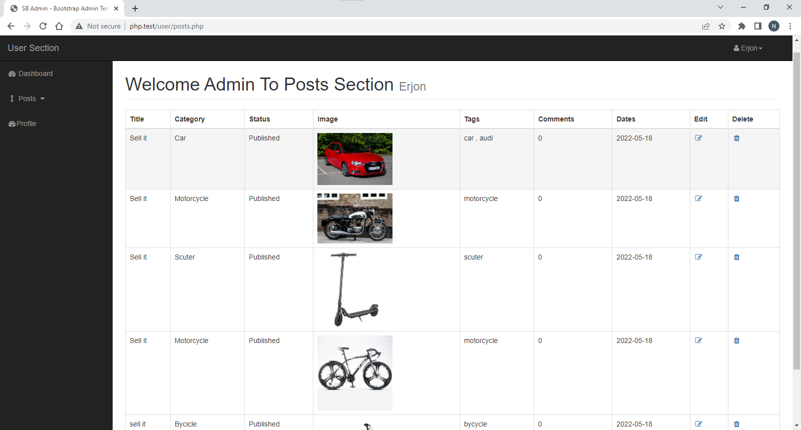
